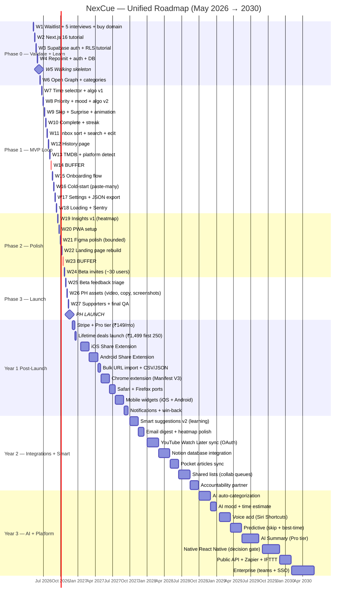

# NexCue — Master Roadmap

> Single source of truth. Consolidates the prior App / Dev / Business / Finances / Research docs plus REMAINING_TASKS.
> Originals preserved in `docs/archive/`.

---

## At a Glance

| | |
|---|---|
| **Product** | Universal "What's Next?" engine — one inbox for saved content, one Decide flow that picks what to consume |
| **Tagline** | *Decide less. Do more.* |
| **North Star Metric** | Weekly Active Completions (items actually consumed per user per week) |
| **Original PH Launch** | 2026-05-22 |
| **Today** | 2026-05-08 |
| **Reality Check** | No Next.js code initialised yet. Original 16-week plan (Feb 1 → May 22) has not started. **Timeline must be replanned — see §11.** |
| **Stack** | Next.js 14 (App Router) · TypeScript · Supabase (Postgres + Auth + RLS) · Vercel · Tailwind · TanStack Query · Framer Motion · `next-pwa` |
| **Initial Investment** | ~₹30,000 (domain, legal, assets, marketing) |
| **Ground Rule** | Never scrape Instagram / Netflix / TikTok / X. Share-sheet + official APIs only. |

---

## 1. Vision & Problem

People save thousands of items across YouTube Watch Later, Netflix My List, Instagram saves, browser bookmarks, podcast queues, recipe pins, wishlists, articles, courses — and revisit almost none of it. Saving is dopamine; consuming is friction. The result is content guilt and decision paralysis.

NexCue solves a single question: **"What should I do next?"** Tell it how much time you have and (optionally) your mood; it picks one thing from your queue and lets you start in one tap.

Core philosophy:
- **One decision** — you pick time, NexCue picks the item.
- **No guilt** — skipping is valid; archives are clean.
- **Lighter than social media**, never heavier than the problem.
- **Finish small. Trust clarity. Earn complexity.**

---

## 2. Target Users

| Persona | Snapshot | Core Pain | NexCue Promise | WTP |
|---|---|---|---|---|
| **Streaming Scroller** (Sarah, 28) | Subscribes to 4 services, 20 min deciding each night | Decision paralysis | "1 hr, watch, relaxed" → perfect pick | ₹99–199/mo |
| **Content Collector** (Alex, 32) | 300 Watch Later, 500 bookmarks, saves 10/day | Saves everything, revisits nothing | Progress visible, queue shrinks | ₹149–299/mo |
| **Recipe Saver** (Priya, 35) | 200 Insta recipes, ends up ordering food | "No time, no energy to decide" | "45 min, cook" → tonight's dinner | ₹149–299/mo |
| **Podcast Hoarder** (Mike, 40) | 100+ queued episodes, always behind | Can't prioritise, guilt-skip old ones | Age boost surfaces older items | ₹149–299/mo |

**Demographics target mix (Year 1):** Streaming Millennials 35% · Knowledge Workers 30% · Content Creators 15% · Podcast Enthusiasts 10% · Recipe Savers 10%.

**Strategic note from Business doc:** start with ONE persona for narrative focus (e.g., the Watch Later hoarder), then expand. *Open question — see §11.*

---

## 3. Product Scope

### 3.1 Categories (built-in)
📺 Watch · 📚 Read · 🎧 Listen · 🎓 Learn · 🍳 Cook · ⚡ Do · 🛒 Buy · 📍 Visit · ✨ Custom

### 3.2 Item Properties
Title · Category · Time Estimate (Quick ≤15 / Medium 20–45 / Long 1+ hr) · Priority (Low/Normal/High/Urgent) · Mood Tags (Relaxing / Energizing / Focused / Fun / Productive) · Source URL · Notes · Thumbnail · Status (New / In Progress / Completed / Skipped / Archived).

### 3.3 The Decide Engine (the differentiator)

**Flow:** time → (mood) → (category) → single suggestion → Start / Skip / Show Another / Not Interested.

**Algorithm weights:**
- Time match — 35%
- Category / mood match — 20%
- Priority — 15%
- Age (older items get a slight boost to prevent rot) — 15%
- Mood match — 10%
- Completion history — 5%

Plus a **Surprise Me** mode (random, weighted by priority + age) and contextual hints (morning → Listen, evening → Watch, weekend afternoon → Learn/Do).

### 3.4 Add Methods (by phase)
| Method | Phase |
|---|---|
| Manual entry | 1 (MVP) |
| URL paste + Open Graph + TMDB | 1 (MVP) |
| iOS / Android Share Extension | 2 |
| Browser Extension (Chrome / Safari / Firefox) | 2 |
| YouTube / Notion / Pocket sync (official APIs) | 4 |
| AI auto-categorize / voice add | 6 |

### 3.5 Anti-Patterns (do NOT build)
- Aggressive notifications (anxiety).
- "Streak broken" guilt language.
- Social leaderboards.
- Big "247 items waiting!" anxiety counters.
- Auto-import everything (defeats intentionality).
- Heavy gamification.

---

## 4. Tech Stack & Architecture

### 4.1 Stack
| Layer | Choice |
|---|---|
| Framework | Next.js 14 (App Router, RSC) |
| Language | TypeScript |
| State | TanStack Query (server) + Zustand (client) |
| Backend | Supabase (Postgres + Auth + Realtime + Edge Functions) |
| Hosting | Vercel |
| Styling | Tailwind CSS |
| Animation | Framer Motion |
| PWA | `next-pwa` |
| Metadata | Open Graph (`open-graph-scraper` / `cheerio`), TMDB API |
| Analytics / Errors | PostHog · Sentry · Resend (email) |

### 4.2 Database (core tables)
- **profiles** — id, email, name, avatar, preferences, stats
- **categories** — id, user_id, name, icon, color, is_default
- **items** — id, user_id, category_id, title, url, thumbnail, time_estimate, priority, mood_tags, status, notes, source_platform, metadata (JSON), created_at, completed_at
- **completions** — id, user_id, date, items_completed, categories (JSON)

RLS policies on every table.

### 4.3 Repo layout
```
nexcue/
├── app/
│   ├── (auth)/           login | signup | forgot-password
│   ├── (main)/           inbox | decide | history | insights | settings
│   ├── api/              items | suggest | metadata | share
│   └── layout.tsx
├── components/           ui | items | decide | layout
├── lib/                  supabase | metadata | hooks | utils | types
└── public/               icons | manifest.json
```

### 4.4 Platform integration reality
> User permission ≠ data access. APIs decide, not users.

| Platform | Saved items via API? | Approach |
|---|---|---|
| YouTube · Notion · Pocket | ✅ Yes | Official OAuth (Phase 4) |
| Instagram · TikTok · Netflix · X · Pinterest · Spotify queues | ❌ No | Share-sheet only — **never scrape** |

---

## 5. Phased Roadmap

> **Note:** dates below are the *original* plan from the source docs. Today is 2026-05-08 with zero code shipped, so Phase 1 dates will slip. Replan happens in §11.

### Phase 1 — MVP (16 weeks · originally Feb 1 → May 22, 2026)

**Foundation (Weeks 1–3)**
- Next.js 14 project init, Supabase project + schema, GitHub + Vercel CI/CD
- Figma design system (tokens: colors, spacing, typography)
- Core UI: Button, Card, Input, Modal, Header, BottomNav
- Dark mode, category icons + colors
- Supabase Auth (Email + Google + Apple), protected routes middleware
- Profile creation, default + custom categories, onboarding flow

**Core MVP (Weeks 4–8)**
- Schema finalised, RLS policies, CRUD hooks, TS types
- Add Item form (title / category / time / priority / mood)
- URL paste → Open Graph fetch → platform detect → TMDB lookup
- Inbox view (list, filters, sort, edit, delete/archive)
- **Decide Engine:** time selector → mood/category filter → suggestion algo → Start/Skip/Show Another → Surprise Me → completion animation + quick notes

**Polish (Weeks 9–11)**
- History (timeline, filter by category/date, search)
- Insights (weekly summary, streak, calendar heatmap, category chart, queue size, "time saved")
- Settings (theme, notifications, defaults), profile edit, JSON export
- Loading / empty / error states everywhere, micro-animations
- Lighthouse audit ≥ 90

**Launch (Weeks 12–16)**
- `next-pwa` (manifest, service worker, all icon sizes), offline basic, install prompt
- Manual QA, cross-browser, mobile devices, perf, security audit
- Landing page (Next.js, SEO, OG images, demo GIF, testimonials)
- Beta: 30–50 invites + Typeform feedback + bug fixes
- Product Hunt launch + Twitter / LinkedIn / Indie Hackers announcement

**Phase 1 deliverable:** Web app + PWA, public launch.

---

### Phase 2 — Extensions (Months 5–7 · Jun–Aug 2026)
- iOS Share Extension (Swift/SwiftUI, Supabase Swift SDK)
- Android Share Extension (Kotlin/Jetpack Compose, Intent filters)
- Chrome Extension (Manifest V3): popup, one-click save, right-click "Add to NexCue", `Cmd+Shift+N`
- Safari Web Extension
- Bulk URL import (paste 10+), CSV/JSON import, JSON export, item expiration ("archive if untouched 60 days"), advanced filters

### Phase 3 — Intelligence (Months 8–10 · Sep–Nov 2026)
- Insights v2: GitHub-style heatmap, time-of-day patterns, content-aging report, weekly email digest, completion velocity
- Smart Suggestions v2: learn from completion patterns, "you usually skip this type" detection, seasonal/mood playlists, "continue where you left off"
- Mobile widgets (iOS WidgetKit + Android Glance): quick suggestion, queue size, decide button, today's progress
- Notifications: configurable daily nudge, win-back at 7 days idle, weekly summary, smart-only-when-queue-growing
- Firefox extension port

### Phase 4 — Integrations (Months 11–14 · Dec 2026 – Mar 2027)
| Platform | Type | Priority |
|---|---|---|
| YouTube Watch Later | OAuth sync | High |
| Notion databases | OAuth import | High |
| Pocket articles | OAuth sync | High |
| Spotify podcast episodes | If API allows | Medium |
| Kindle / Goodreads "Want to Read" | Import | Medium |
| Todoist → "Do" | Import | Low |

Patterns: one-time auth, initial bulk import, optional periodic sync (daily/weekly), two-way completion (mark complete in NexCue → also in source).

Plus metadata APIs: Open Library (books), Podcast Index (episodes), Product Hunt (tech).

### Phase 5 — Social (Year 2)
- Shared lists (collaborative queues, share via link, family "watch together")
- Accountability partners (streaks visible, gentle nudges, weekly comparison)
- Optional community: public curated lists, "popular this week", follow other queues, item comments

### Phase 6 — AI (Year 2–3)
- AI categorization: auto-detect category, time estimate, mood tags, smart title (~₹0.83/item via OpenAI)
- Voice: "Hey Siri, add this to NexCue"; "What should I watch?"; voice notes (Whisper / Web Speech)
- Predictive: skip prediction, best-time-to-suggest, smart archive, "you haven't touched Learn in 2 weeks" nudge
- AI summary (Pro tier): article TL;DR, YouTube key points, "why you saved this" reminder

### Phase 7 — Platform Expansion (Year 3, only if needed)
- Native React Native iOS/Android (only if PWA insufficient)
- Desktop (Tauri or Electron — only if user demand)
- Public API + Zapier + IFTTT + webhooks
- Enterprise: team workspaces, admin dashboard, SSO/SAML, audit logs, white-label

---

## 6. Business Model & Pricing

### 6.1 Tiers
| Tier | Monthly | Yearly | Limits |
|---|---|---|---|
| Free | ₹0 | ₹0 | 25 items · 3 categories · 7-day history · basic Decide |
| Pro | ₹149 | ₹999 (44% off) | Unlimited · smart Decide + mood · full history · full insights · export · browser ext · priority support |
| Team | ₹299/user | ₹2,499/user (30% off) | Pro + shared lists + team stats |

Positioned alongside Netflix Mobile (₹149) / Spotify (₹119) / YouTube Premium (₹139) / Notion (₹96).

### 6.2 Launch offers
- Lifetime Early Bird ₹1,499 (first 250) → Lifetime Standard ₹2,499 (next 500). Total 750 → ~₹16.2L.
- Product Hunt deal: 40% off first year (₹599).
- Student discount 50% (.edu).
- Referral: 1 month free both sides.

### 6.3 Revenue mix
Subscriptions 80–85% · LTDs 10–15% · B2B/Team 5% (later).

---

## 7. Financials

### 7.1 Costs
**Infra free tiers cover ~20–30K active users:** Vercel (100GB), Supabase (500MB / 50K MAU), PostHog (1M events), Sentry (5K errors), Resend (100/day), TMDB (free).

**Year 1 operating: ~₹50K/yr** (Supabase overage buffer, domain ₹1.5K, email, marketing ~₹25K, misc).
**Year 1 one-time: ~₹14.5K** (domain, premium assets, legal templates, video/GIF).
**Phase 2 dev licences: ~₹11K** (Apple ₹8.5K/yr, Google Play ₹2.1K once, Chrome ₹500 once).

**Cost scaling:**
| Active users | Monthly cost |
|---|---|
| 0–5K | ₹0–2K |
| 5–15K | ₹2–5K |
| 15–30K | ₹5–10K |
| 30–50K | ₹10–20K |
| 50K+ | ₹25K+ |

### 7.2 Projections (conservative)
| Period | Total users | Paid | Conv. | MRR | Notes |
|---|---|---|---|---|---|
| Month 1 | 1,000 | 75 | 7.5% | ₹9K | Launch month |
| Month 3 | 3,000 | 300 | 10% | ₹37.5K | |
| Month 6 | 8,000 | 1,040 | 13% | ₹1.3L | |
| Month 9 | 12,000 | 1,920 | 16% | ₹2.5L | |
| Month 12 | 18,000 | 3,240 | 18% | ₹4.2L | |

**Year 1 P&L:** Revenue ₹31.2L (subs ₹15L + LTDs ₹16.2L) − Costs ₹0.71L = **Profit ₹30.5L (~98% margin).**

**3-year:** Y1 18K users / ₹30L profit · Y2 60K / ₹72L · Y3 150K / ₹2.25Cr.

**Break-even:** ~250 users (~Week 2–3 post-launch) at ₹3K/mo fixed.

### 7.3 Unit economics target
CAC organic ₹0–25 · CAC paid ₹150–250 · LTV (12mo) ₹1,200–1,800 · LTV:CAC ≥ 6× · ARPU ₹125–150 · Gross margin 95%+.

### 7.4 Cost-control rules
1. Never exceed ₹10K/mo until MRR covers it.
2. Billing alerts at ₹2K / ₹5K / ₹10K.
3. Free tier first; upgrade only when forced.
4. LTDs fund ops; don't spend MRR until Month 6.
5. Reinvest 30% of profit, save 70%.

---

## 8. Go-To-Market

### 8.1 Pre-launch (now → launch − 6 weeks)
- Build in public on Twitter/X (weekly updates).
- Landing page with waitlist, problem-focused copy ("Tired of your Watch Later graveyard?"). Target: 500 signups.
- Discord beta community, 30–50 testers. Collect testimonials.

### 8.2 Launch week
- Product Hunt: Tuesday 12:01 AM PT. Tagline *"Your 'What's Next?' engine for all saved content."* Self-hunt or relevant hunter. Personal-story maker comment. Demo video, 4 product images, GIFs. Line up 50+ supporters. Goal: top 5 of day, 500+ upvotes.
- Twitter / LinkedIn / Indie Hackers / Reddit (r/productivity, r/getdisciplined — careful, value-first).

### 8.3 Months 2–6 (content/SEO)
| Article | Target search volume |
|---|---|
| "YouTube Watch Later is broken" | 10K/mo |
| "Netflix My List overwhelm solution" | 5K/mo |
| "Bookmark organisation system" | 5K/mo |
| "How to actually use saved content" | 3K/mo |
| "Decision fatigue for streaming" | 2K/mo |

### 8.4 Channel mix Year 1
| Channel | Cost | Expected users | Window |
|---|---|---|---|
| Product Hunt | ₹0 | 1–2K | Week 1 |
| Indie Hackers | ₹0 | 200–500 | Months 1–2 |
| Twitter organic | ₹0 | 500–1K | Months 1–6 |
| SEO / Content | ₹0 | 2–5K | Months 3–12 |
| Reddit (careful) | ₹0 | 300–500 | Ongoing |
| Word of mouth | ₹0 | 1–3K | Months 6–12 |
| **Total Y1** | **~₹20K** | **5–15K** | |

---

## 9. Metrics & Success

### 9.1 North star
**Weekly Active Completions** (not opens, not adds).

### 9.2 Targets
| Metric | M6 | M12 |
|---|---|---|
| WAU | 5,000 | 15,000 |
| Completions / user / week | 7 | 10 |
| D7 retention | 35% | 45% |
| D30 retention | 20% | 30% |
| Avg queue size | 50 | 75 |
| Decision time saved | 10 min/wk | 15 min/wk |
| Free→Paid conversion | 13% | 18% |
| Monthly churn | <6% | <5% |
| NPS | 45+ | 55+ |

### 9.3 Pre-build validation gates
- 20 user interviews → 15+ confirm frustration.
- Landing page → 10%+ waitlist conversion.
- "Would you pay ₹149/mo?" → 8/20 yes.
- Reddit/Twitter problem post → 50+ engagement.

### 9.4 Post-launch PMF gate
Sean Ellis test: "How disappointed if NexCue disappeared?" — target ≥40% "Very disappointed."

---

## 10. Risks & Mitigations

| Risk | Likelihood | Impact | Mitigation |
|---|---|---|---|
| Habit formation fails | High | High | Completion dopamine, satisfying animations, visible queue shrinking |
| "Another app" fatigue | High | High | Stay lighter than the problem; share-sheet beats opening app |
| Platform APIs blocked | High | High | MVP needs zero API deps. Share-sheet + URL paste only |
| Low D7 retention | High | High | Nail first-week experience; sample queue for cold start |
| No Product Hunt feature | Medium | Medium | Multiple parallel launch channels |
| Free tier too generous | Medium | Medium | 25-item cap; monitor conversion |
| Share extension low adoption | Medium | Medium | Onboarding teaches the share habit |
| Competitor copies | Medium | Medium | Move fast, build community moat |
| Infra cost spike | Low | Medium | Billing alerts, free-tier first |
| Lifetime deals oversold | Low | Medium | Hard cap 750 |

**Cold-start fix (built into MVP):** "Add your first 5 items" prompt · sample queue option · paste-5-URLs quick start · first Decide suggestion fires after 3 items.

---

## 11. Decisions Locked (2026-05-08 1-1)

| # | Decision | Implication |
|---|---|---|
| 1 | **Solo build, ~5–10 hrs/week** (~7 avg) | Original 4-person 16-week plan dies. ~196 hrs total budget. |
| 2 | **Real blocker = skills gap, felt overwhelmed** | Phase 0 is a learning ramp, not jumping straight in. Tutorial app first, NexCue second. |
| 3 | **Target: 2026-11-22 PH launch** (~28 weeks from today) | Aggressive but doable *only* with strict scope discipline. 2-week buffer baked in. |
| 4 | **Universal "all saved content" pitch** (everyone relates) | Marketing copy uses ONE vivid example per channel even though product is universal. Don't sell the abstraction. |
| 5 | **Stack: Next.js 16 + Cache Components** | Slightly steeper learning curve, but current tutorials and longest support runway. |
| 6 | **Never built with this stack** | Phase 0 dedicates 3 weekends to a throwaway tutorial app before touching NexCue code. |
| 7 | **Budget: ~₹5,000** | Domain + essentials only. No paid templates, no ads, no Tailwind UI. shadcn + free Lucide + free Vercel/Supabase tiers. |
| 8 | **Free at launch, Pro at Month 3** | Skip Stripe in MVP. Saves ~2 weekends. Add ₹149/mo Pro tier + ₹1,499 LTD in Dec 2026. |
| 9 | **No validation done yet** | Phase 0 Week 1 = 5 informal interviews + waitlist landing page + one problem-post on Twitter/Reddit. Don't skip. |
| 10 | **Working pattern: 1–2 long weekend sessions/week** | One shippable milestone per weekend. Every weekend ends with a deploy or a deletable branch. |
| 11 | **Design: shadcn/ui baseline (non-negotiable), Figma as bounded polish in Phase 2** | Prevents the design-phase procrastination trap. Pretty pixels don't ship; deployed ugly does. |
| 12 | **ADHD all-or-nothing** | Plan optimises for momentum: visible weekly progress, no abstract design phases, no "preparation" weekends. |

---

## 12. Active Plan + Long-Horizon Roadmap

> Phases 0–3 (now → Nov 2026) are weekly weekend missions, ~7 hrs/week, ~196 hrs total. Buffer weeks (W14, W23) absorb up to 2 misses. Year 1+ blocks are coarser monthly estimates that will tighten as PMF data lands.

### 12.0 Unified visual roadmap



> **Viewing:** renders natively on GitHub, GitLab, and VS Code (with the Mermaid extension). For PNG/SVG export, paste the block into [mermaid.live](https://mermaid.live).

---


### Phase 0 — Validate + Learn (Weeks 1–6 · May 9 – Jun 21)

**Goal: by Jun 21, you can ship a Next.js 16 + Supabase app end-to-end, you have 50 waitlist signups, and a "walking skeleton" of NexCue is live at a real URL.**

| W | Dates | Mission | Ship |
|---|---|---|---|
| 1 | May 9–11 | Buy `nexcue.com`. Build a 1-page waitlist landing on Vercel using a free template. Email field → Resend. Tweet the problem ("My YouTube Watch Later has 247 videos. Same?"). DM 5 people you know who hoard content; 15-min calls. | Live waitlist URL + 5 interview notes |
| 2 | May 16–18 | Tutorial sprint #1: official Next.js 16 App Router tutorial (the one with Acme dashboard) — finish it, no skipping. Push to GitHub + Vercel. | Deployed tutorial app |
| 3 | May 23–25 | Tutorial sprint #2: Supabase Auth + Postgres + RLS via official "Build a Todo App with Next.js + Supabase" guide. Add Google OAuth. | Deployed todo app with auth |
| 4 | May 30 – Jun 1 | Repo init: `nexcue` Next 16 + Supabase + shadcn + Tailwind + Lucide. `profiles` and `items` tables. Auth (Google only). Empty inbox page that lists items from DB. | `nexcue.com` shows login → empty inbox |
| 5 | Jun 6–8 | Add Item form (title + URL only — no metadata yet). Inbox shows cards. Delete works. **Decide page**: button that picks one random item from your queue. | Walking skeleton: add → list → decide. |
| 6 | Jun 13–15 | Open Graph fetcher (`open-graph-scraper`) so URL paste auto-fills title + thumbnail. Categories table + dropdown (the 7 defaults). Filter inbox by category. | Inbox feels real. Take a screenshot — this is your "I'm building" tweet. |

**Phase 0 honest checks:** if W2–W3 tutorials feel impossibly slow, you haven't found a learning style yet — switch to a paid Udemy course (worth blowing the ₹5K). If W5 doesn't deploy, the project is in trouble; stop and ask why.

### Phase 1 — MVP Loop (Weeks 7–18 · Jun 22 – Sep 13)

**Goal: by Sep 13, the full Decide loop works end-to-end with mood, time, history, and dark mode.**

| W | Mission |
|---|---|
| 7 | Time estimate field (Quick / Medium / Long). Decide page: time-selector chips. Algorithm v1: filter by time, then random. |
| 8 | Priority field (Low/Normal/High/Urgent). Mood tags multi-select. Algorithm v2: weighted (time 40%, priority 25%, age 20%, mood 15%). |
| 9 | "Skip" / "Show another" / "Not interested" actions. "Surprise me" mode. Completion animation (Framer Motion). |
| 10 | Mark complete → moves to `completions` table → updates streak. Quick note on completion. |
| 11 | Inbox: sort options (priority / date / time), search, edit modal, archive. |
| 12 | History page: timeline list, filter by category, filter by date range. |
| 13 | TMDB integration for Netflix/movie URLs. Platform detection (YouTube / Netflix / generic). |
| 14 | **Buffer week.** If on track: dark mode + theme persistence. |
| 15 | Onboarding flow for new users: "Add your first 3 items" + sample queue option. |
| 16 | Cold-start: paste-multiple-URLs quick add. First Decide fires after 3 items with a tutorial overlay. |
| 17 | Settings page: theme, default categories, JSON export. |
| 18 | Loading / empty / error states across every page. Sentry + PostHog wired up. |

**Phase 1 honest checks:** if you're 2+ weekends behind by W12, cut features (drop Surprise Me, drop search, drop date-range filter) — never push the launch date.

### Phase 2 — Pre-Launch Polish (Weeks 19–24 · Sep 14 – Oct 25)

| W | Mission |
|---|---|
| 19 | Insights v1: streak counter + GitHub-style heatmap + weekly completion count. `recharts`. |
| 20 | PWA setup: `next-pwa`, manifest, all icon sizes (use [realfavicongenerator.net](https://realfavicongenerator.net)), service worker, install prompt. |
| 21 | **Figma weekend** (bounded — one weekend only). Define type scale, color tokens, micro-animations. Apply to inbox card + decide card. Stop. |
| 22 | Landing page rebuild: hero, problem, demo GIF (use [Loom](https://loom.com) free), 3 testimonials from beta, CTA. SEO + OG image. |
| 23 | **Buffer week.** If on track: Lighthouse audit, fix anything <90. |
| 24 | Beta invite list (~30 people from waitlist + Twitter). Send invites + Typeform feedback survey. |

### Phase 3 — Launch (Weeks 25–28 · Oct 26 – Nov 22)

| W | Mission |
|---|---|
| 25 | Beta feedback triage: tag bugs P0 / P1 / P2. Fix all P0 + top-5 P1. |
| 26 | PH assets: 60-sec demo video (Loom + simple edit), 4 product screenshots (1280×800), tagline ("Decide less. Do more."), maker comment draft (personal story about content guilt). |
| 27 | Lock 50+ supporters for PH launch day. Final QA on 3 devices (your phone, one Android, one Safari). |
| 28 | **Launch week.** Tuesday Nov 17 12:01 AM PT → Product Hunt. Tweet + Indie Hackers post + LinkedIn + r/productivity (value-first, no spam). Monitor + respond all day. |

### Post-Launch (Dec 2026 onwards)

- Dec 2026 (Month 1 post-launch): Stripe + Pro tier (₹149/mo, ₹999/yr) + LTD ₹1,499 first-250 + ₹2,499 next-500. Launch on Twitter, not PH-2.
- Q1 2027: pivot to **Phase 2 of master roadmap** (Share Extensions) — see §5.

### Working agreements for the next 28 weeks

1. **Every weekend ends with a deploy or a deletable branch.** No "I redesigned the database schema, will commit next week." Either it ships or it dies.
2. **One feature, one weekend.** Don't try to land two big things. ADHD will sabotage the second one.
3. **No new docs.** This file is the plan. If you want to write something, ship it instead.
4. **If a weekend is missed, slide every later row down by one — don't skip.** The launch date is sacred; the buffer weeks (W14, W23) absorb up to 2 misses.
5. **If 3 weekends miss in a row,** stop and tell Claude. Something else is wrong; fix the system, not the symptom.
6. **The 7-hour week is the budget.** Don't celebrate 15-hour weeks; that's burnout fuel for an ADHD brain. Steady-state wins.

---

*Last updated: 2026-05-08. Replaces App.md / Dev.md / Business_Analysis.md / Finances.md / Research.md / REMAINING_TASKS.md (archived in `docs/archive/`).*
